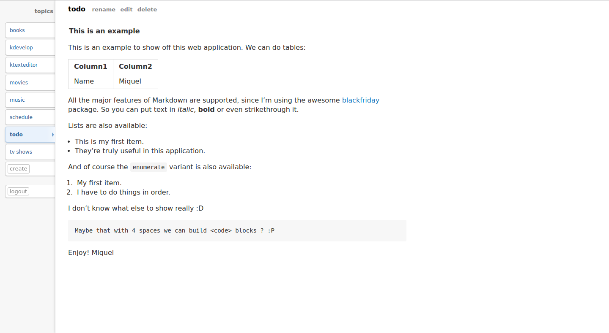

# ToDo [](https://travis-ci.org/mssola/todo)

## About this application

This application has a simple job: handle my "To Do list". This might seem
trivial but I got to a point where my To Do list was a scrambled mess that was
scattered throughout my system. To fix this situation I've built a service that
has the following specifications:

* There only exists one user in the database.
* The "To Do" list is organized in topics. Topics can be created, deleted,
  renamed, updated, etc.
* A topic has contents, that are written in Markdown.

This application implements two things: a web application and an API layer.

### The Web Application

The web application has a quite minimalistic design and it only consists of two
different pages:

1. The `login` page.
2. The `topics` page. This is the main page and in it the user can create new
   topics, read their contents, update them, etc.

The style for this web application has been taken from Reddit's one (the list
of topics in this application has the same style as the list of multireddits).
The markdown being shown has a similar style as the one from Github. A
snapshot:



### The JSON API

This application also implements a JSON API. This API can be accessed by
setting `application/json` in the `Content-Type` or the `Accept` header of the
request. First of all, you have to login with the application. In order to do
so, you have to perform a POST HTTP request with the following body:

```json
{
  "name":     "name-of-the-user",
  "password": "password-for-this-user"
}
```

If everything was ok, the response should only be a JSON object with the
`token` key. The value for this key has to be used on every request afterwards
by adding it to the URL query part. With this in mind, we can now call any
method of this simple REST API:

|    Method   |        Path       | Keys in the JSON body |     Response    |
|:-----------:|:-----------------:|:---------------------:|:---------------:|
|GET          | /topics           |            -          | Array of Topics |
|POST         | /topics           |          name         |      Topic      |
|GET          | /topics/{topicId} |            -          |      Topic      |
|PUT or PATCH | /topics/{topicId} |    name or contents   |      Topic      |
|DELETE       | /topics/{topicId} |            -          |     Message     |


The fourth method is the update method. It accepts either the name or the
contents, but not both parameters at the same time. We might want to pass the
`name` key when renaming a topic. We will pass the `contents` key if we
want to update the contents of a topic. Moreover, the last method is the delete
method. This method responds with a `Message` object. A `Message` object
contains the key `msg` on success, and the `error` key on error.

Let's see a quick example (cURL with the `--trace-ascii` option):

    0000: POST /topics?token=6b6c0542-0891-4614-5dd8-92ce443dbcaf HTTP/1.
    0040: 1
    0043: User-Agent: curl/7.38.0
    005c: Host: localhost:3000
    0072: Accept: */*
    007f: Content-Type: application/json
    009f: Content-Length: 17
    00b3:
    => Send data, 17 bytes (0x11)
    0000: {"name": "topic"}

The create method will respond with the newly created Topic on success:

```json
{
  "id":         "ec654b88-e227-47bb-6254-60b77329732e",
  "name":       "topic",
  "contents":   "",
  "created_at": "2014-10-07T08:37:05.424276522+02:00",
  "markdown":   ""
}
```

So, let's explain the `Topic` object. The `id`, `name` and `created_at` columns
are quite self-explanatory. The `contents` column exposes the raw data of this
object. The `markdown` object contains the HTML code that has been produced
after rendering the markdown of the `contents` column.

## Getting this application up and running

This application uses the Go programming language and some awesome packages
like negroni, gorilla/mux, blackfriday, etc. Moreover, it uses PostgreSQL
for the database. You can install the dependencies manually and setup
the db/database.json file by yourself, or you can just perform the
following command:

    $ ./script/kickstart

It will ask for a few DB-related things: the user, the dbname and the password.
After this, you can install this like any other Go program and run it:

    $ go install
    $ todo

Last but not least, this application can be deployed to Heroku. Here are some
notes about it:

* This application uses PostgreSQL, so you have to setup PostgreSQL in
  Heroku as well.
* Even though this application uses Sass, it has the resulting compiled CSS
  files in it. This is done this way so we don't have to mess with Sass on
  deployment.
* We'll have to use a third-party buildpack in order to deploy this
  application.

So, pick up your terminal and perform the following command:

    $ heroku create -b https://github.com/kr/heroku-buildpack-go.git

This will create the application with a Go buildpack setup. You should now go
to this application's config page on Heroku and add it the PostgreSQL add-on.
After this, no more configuration is needed, so you can just perform the
following command:

    $ git push heroku master

And that's it, you've deployed this application to Heroku!

## License

Copyright &copy; 2014-2015 Miquel Sabaté Solà

Permission is hereby granted, free of charge, to any person obtaining
a copy of this software and associated documentation files (the
"Software"), to deal in the Software without restriction, including
without limitation the rights to use, copy, modify, merge, publish,
distribute, sublicense, and/or sell copies of the Software, and to
permit persons to whom the Software is furnished to do so, subject to
the following conditions:

The above copyright notice and this permission notice shall be
included in all copies or substantial portions of the Software.

THE SOFTWARE IS PROVIDED "AS IS", WITHOUT WARRANTY OF ANY KIND,
EXPRESS OR IMPLIED, INCLUDING BUT NOT LIMITED TO THE WARRANTIES OF
MERCHANTABILITY, FITNESS FOR A PARTICULAR PURPOSE AND
NONINFRINGEMENT. IN NO EVENT SHALL THE AUTHORS OR COPYRIGHT HOLDERS BE
LIABLE FOR ANY CLAIM, DAMAGES OR OTHER LIABILITY, WHETHER IN AN ACTION
OF CONTRACT, TORT OR OTHERWISE, ARISING FROM, OUT OF OR IN CONNECTION
WITH THE SOFTWARE OR THE USE OR OTHER DEALINGS IN THE SOFTWARE.

